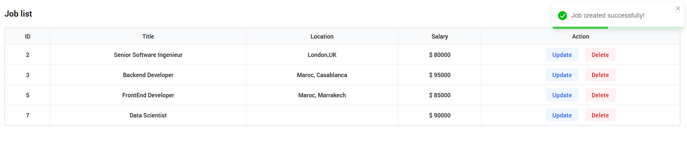
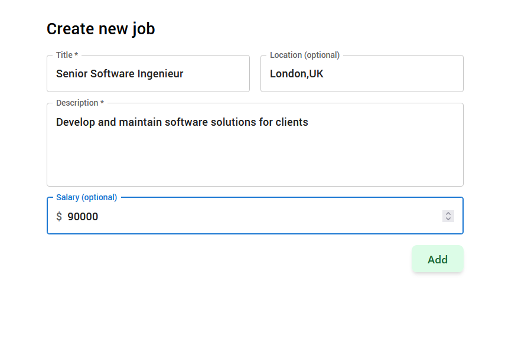
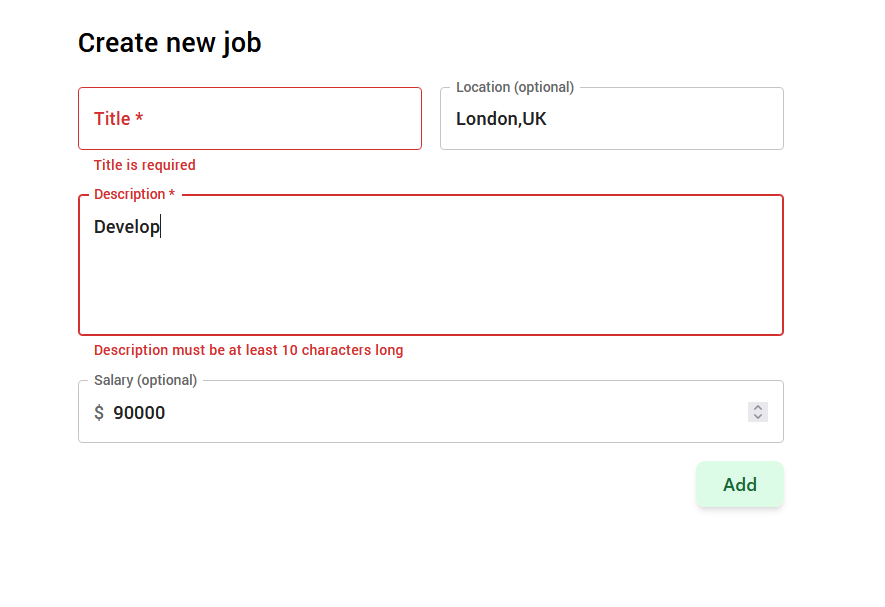

# Job Management System

## Table of Contents

- [Overview](#overview)
- [Features Implementation](#features-implementation)
  - [Job List Page](#job-list-page)
  - [Add Job Functionality](#add-job-functionality)
  - [Edit Job Functionality](#edit-job-functionality)
  - [Delete Functionality](#delete-functionality)
- [Technical Details](#technical-details)
- [Additional Enhancements](#additional-enhancements)

## Overview

This document showcases the implementation of the Job Management System as per the assignment requirements. The system provides a full-stack solution for managing job postings with a Next js frontend and Spring Boot backend.

## Features Implementation

### Job List Page

The main dashboard implements:

- Responsive table displaying all job listings
- Sortable columns for Title, Location, and Salary
- Action buttons for Edit and Delete operations
- "Add Job" button for creating new listings

### Add Job Functionality

The job creation interface features:

- Form validation for required fields
- Material UI form components
- Success notifications on completion

### Edit Job Functionality

The edit functionality includes:

- Pre-populated form fields
- Real-time validation
- Update confirmations

### Delete Functionality

Implemented with:

- Confirmation dialog
- Success notifications
- Error handling

## Technical Details

### Frontend Implementation

- Framework: Next.js 14 (app router)
- UI Library: Material UI
- Local state Management: React Hooks (useState, useEffect)
- Server state Management: Tanstack Query

### Backend Implementation

- Framework: Spring Boot 3
- Database: MySQL
- Architecture: MVC pattern

### API Endpoints

## Additional Enhancements

### Responsive Design

### User Notifications

Features implemented:

- Success notifications
- Error handling
- Operation confirmations
