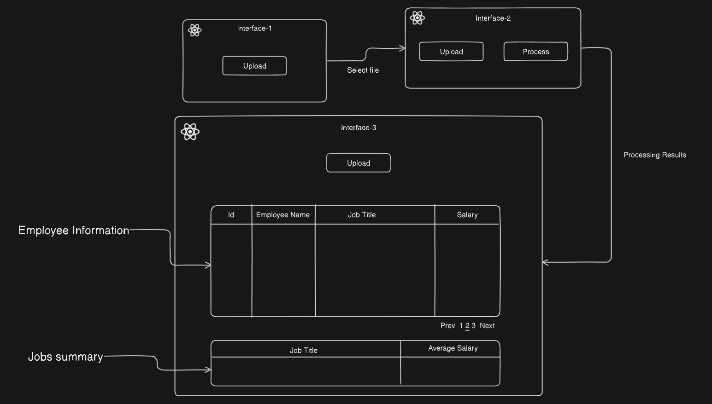
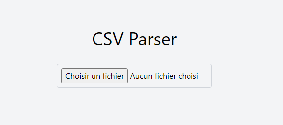
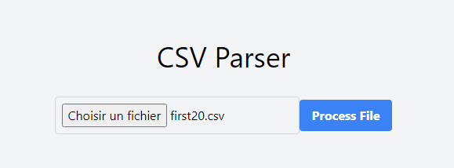
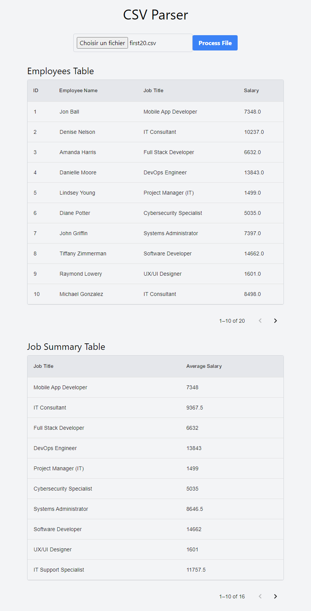

## DNA Engineering Full-Stack Assignment
Build a CSV Parser.

## Table of content
- [Prerequisites](#prerequisites)
- [Before We begin](#before-we-begin)
- [Assignment](#assignment)
- [What we expect](#what-we-expect)
- [Bonus points](#bonus-points)

## Prerequisites
- Java 17
- Node Js v20.10.0

## Before we begin
- In this assignment, you will be asked to write, and test your code.
- Make sure you respect clean code guidelines.
- Read the assignment carefully.

## Description
You are invited to create a CSV parser using Java/Spring Boot, and build UI to display results using Next.js/React.

## Assignment

### Backend (CSV Parser)

#### Tasks

- Write a service in Java that will read and process the attached CSV(comma separated values) file at `data/employees.csv`.

- This service should read, extract and process data in a suitable data structure.

- Process this data to return the list of employees and a summary indicating the average salary for each job title.

### Frontend

#### Tasks
Implement a simple user interface that will allow the user to upload the file and display the results of your processing.

#### Interfaces

Respect the following design flow:



- **Interface-1**: Contain an upload button.
- **Interface-2**: The Process button is added when you choose a file.
- **Interface-3**: 2 Tables showing the processing results.

**Table 1**: Employee information, displays a paginated list of employees.

**Table 2**: Jobs summary, displays for each job title, the average salary for employees.

## What we expect
- Write a concise, easy to understand code.
- Use good practices.
- Write unit tests for your java code.
- Append to this README your approach and provide instructions to run your project.

## Bonus points
- Implement your own CSV file parser instead of using a library.
- Use design patterns.

## Images from the Project

### Interface 1
The button allowing users to upload a CSV file.


### Interface 2
After selecting the CSV file, this app reveals a "Process File" button, indicating that the file is ready for processing.
For demonstration purposes, a csv file with only the first 20 lines of employees.csv have been used.


### Interface 3
Post-processing, the employee data and the job details data gets displayed in a table format, obtained after the file is processed by the service.



## How to Run the Project

### Frontend
1. Navigate to the `frontend` folder.
2. Run the following commands:
   ```bash
   npm install
   npm start
   ```
3. This will install the necessary dependencies and start the frontend development server.

### Backend
1. Navigate to the `backend` folder.
2. Run the following commands:
   ```bash
   mvn clean install
   java -jar target/backend-0.0.1-SNAPSHOT.jar
   ```
3. This will clean the project, build it, and start the backend server using the generated JAR file.
