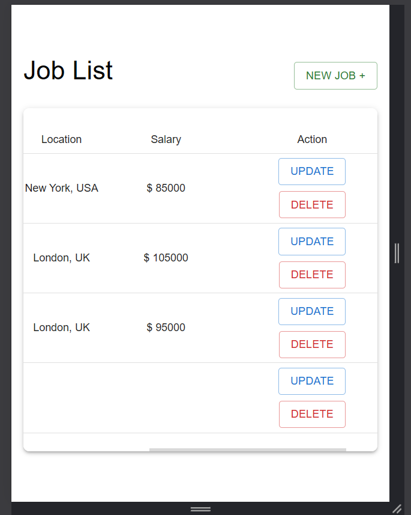

# Job Management System

This project is a full-stack web application for managing job postings, developed using React for the frontend and Spring Boot for the backend, with PostgreSQL as the database. The application provides functionalities to create, read, update, and delete job postings.

---

## Table of Contents

- [Features](#features)
- [Technologies Used](#technologies-used)
- [Project Structure](#project-structure)
- [Setup Instructions](#setup-instructions)
- [Environment Variables](#environment-variables)
- [Endpoints](#endpoints)
- [Screenshots](#screenshots)
- [Notes](#notes)

---

## Features

- View all job postings.
- Add new job postings.
- Edit existing job postings.
- Delete job postings.

---

## Technologies Used

### Frontend

- React
- Material-UI

### Backend

- Spring Boot

### Database

- PostgreSQL

---

## Project Structure

### Frontend

```
frontend/
├── public/
├── src/
│   ├── api/                  # API handling logic
│   │   ├── axios.js          # Axios configuration for API calls
│   │   └── jobsApi.js        # API methods for managing job-related data
│   ├── components/           # Reusable UI components
│   │   ├── JobForm.jsx       # Component for job form (add/edit)
│   │   └── JobTable.jsx      # Component for displaying job listings
│   ├── pages/                # Components representing different pages
│   │   ├── JobAddPage.jsx    # Page for adding a new job
│   │   ├── JobEditPage.jsx   # Page for editing an existing job
│   │   └── JobListPage.jsx   # Page for listing all jobs
│   ├── App.js                # Main application component
│   └── index.js              # Entry point for the frontend, renders App.js
└── .env                      # Environment variables for the frontend
```

### Backend

```
backend/
├── src/
│   ├── main/
│   │   ├── java/
│   │   │   └── ma.dnaengineering.backend/   # Base package for the backend app
│   │   │       ├── controllers/             # API controllers to handle requests
│   │   │       ├── dtos/                    # Data Transfer Objects (DTOs)
│   │   │       ├── entities/                # JPA entities for database models
│   │   │       ├── errors/                  # Custom error handling logic
│   │   │       ├── repositories/            # Data access layer for the database
│   │   │       ├── services/                # Service layer for business logic
│   │   │       ├── servicesImplementations/ # Implementations of the service layer
│   │   │       └── BackendApplication.java  # Main class to run the backend application
│   │   └── resources/
│   │       └── application.properties       # Application-specific configuration (e.g., database settings)
│   └── test/
├── pom.xml                                  # Maven configuration for dependencies and build
└── .env                                     # Environment variables for the backend
```

---

## Setup Instructions

### Prerequisites

- Node.js and npm
- Java Development Kit (JDK) 17 or higher
- PostgreSQL

### Steps

1. Clone the repository:

   ```bash
   git clone https://github.com/ZinebTAGHIA/Full-Stack-Internship-Home-Assignment.git
   ```

2. Set up the backend:

   ```bash
   cd backend
   mvn clean install
   mvn spring-boot:run
   ```

3. Set up the frontend:

   ```bash
   cd frontend
   npm install --legacy-peer-deps
   npm start
   ```

4. Open your browser and navigate to:
   `http://localhost:3000
`

---

## Environment Variables

### Frontend

The `.env` file in the frontend directory contains:

```
REACT_APP_API_BASE_URL=http://localhost:9090
```

### Backend

The `.env` file in the backend directory contains:

```
SPRING_DATASOURCE_URL=jdbc:postgresql://localhost:5432/jobs_db
SPRING_DATASOURCE_USERNAME=postgres
SPRING_DATASOURCE_PASSWORD=password
SERVER_PORT=9090
CROSS_ORIGIN_URL=http://localhost:3000
```

### Note

In a production environment, `.env` files should be added to `.gitignore` to avoid exposing sensitive information. However, for ease of setup in this project, these files are included. Ensure you update the values to match your own environment.

---

## Endpoints

### Backend API

- `GET /jobs` - Fetch all jobs
- `GET /jobs/{id}` - Fetch a job by ID
- `POST /jobs` - Add a new job
- `PUT /jobs/{id}` - Update a job
- `DELETE /jobs/{id}` - Delete a job

---

## Screenshots

1. Job List Page


This is the main page of the application, displaying a list of all job postings. The table includes information such as the job title, location, salary, and options to Update or Delete a job. A New Job button is available for adding new postings.

2. Job Add Page


The Job Add Page allows users to create new job postings by filling in details like the job title, location, description, and salary. Once filled, users can save the job, and it will appear on the Job List Page.

3. Job Edit Page


The Job Edit Page provides a form for updating an existing job's details. Users can modify fields like the title, location, description, or salary and save the changes.

4. Job Delete Confirmation


When a user attempts to delete a job, a confirmation dialog appears to ensure the action is intentional. Users can confirm by clicking Yes or cancel by clicking Cancel.

5. Job Deleted Success Notification


After successfully deleting a job, a green toast notification appears at the bottom-left corner, confirming the deletion. The same toast notification is displayed after completing any action.

6. Responsive Design

The application implements a fully responsive design to ensure an optimal user experience across various screen sizes. Below are some examples of the responsiveness:

- Table:
  - On larger screens, the table displays all columns clearly.
  - On smaller screens, a horizontal scroll is activated to maintain usability without truncating data.
    
    
- Form:
  - The form layout adapts dynamically based on the screen size.
  - On smaller screens, the form fields are stacked vertically, while on larger screens, the layout adjusts to a horizontal orientation for improved usability.
    
    

---

## Notes

- The application uses Material-UI for a responsive and clean UI.
- Ensure PostgreSQL is running and the database `jobs_db` is created before starting the backend.
- CORS is configured to allow requests from `http://localhost:3000`.

---
