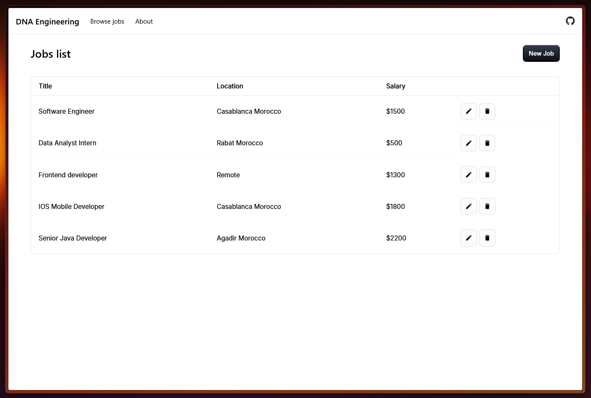
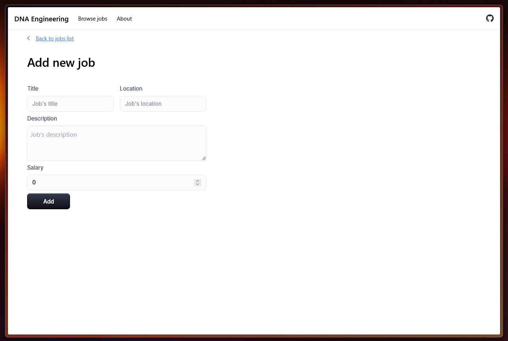
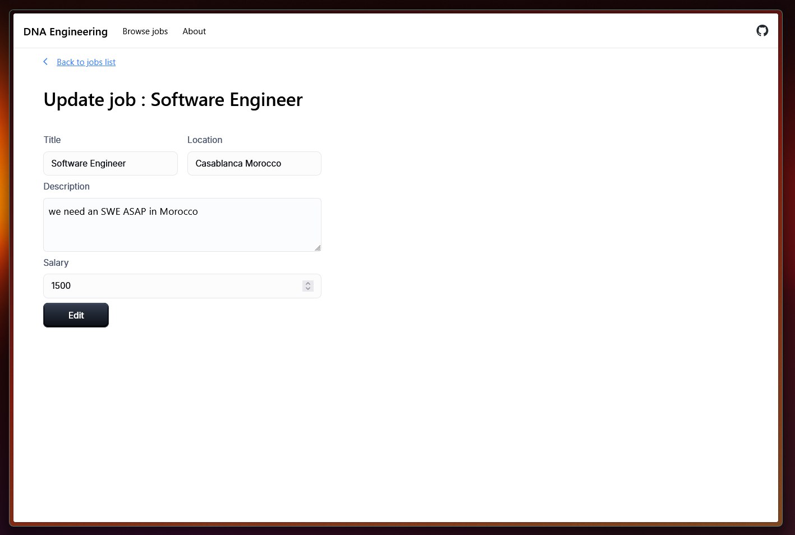
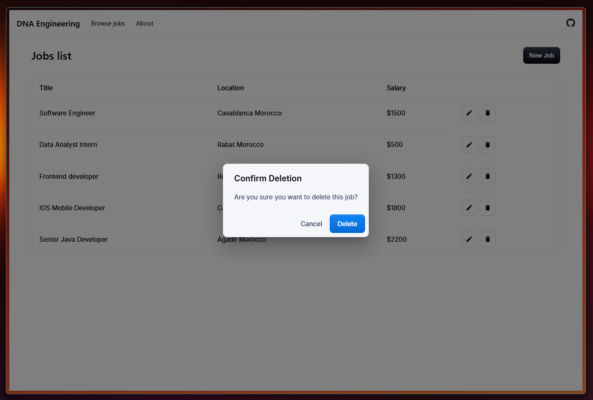
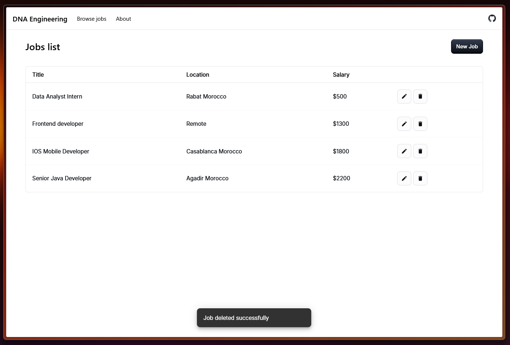
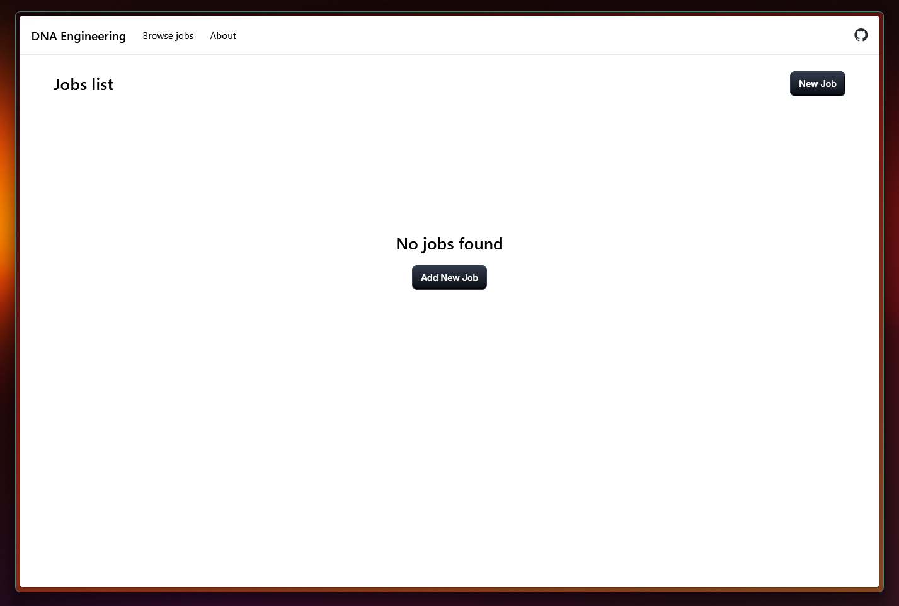

# Candidate Information

Name: Boussakssou Abdessamad
email: <abdoboussakssou@gmail.com>
Github: <https://github.com/COUSCOUSZ>
Portfolio: <https://boussakssou.com/>
LinkedIn: <https://www.linkedin.com/in/boussakssou-abdessamad/>

# Work
## Backend:
1- Handled field validation for the job entity.
2- Handled errors & exception using custom exception & ExceptionHandler.

## Frontend:
1- Used TypeScript for type safety.
2- Used an MUI custom theme.
3- Used tailwindCSS for additional styling
4- Added toast for user feedback

## Screenshots:
#### All jobs

#### Adding a job

#### Updating a job

#### Deleting a job modal

#### Deletion toast

#### No jobs found
